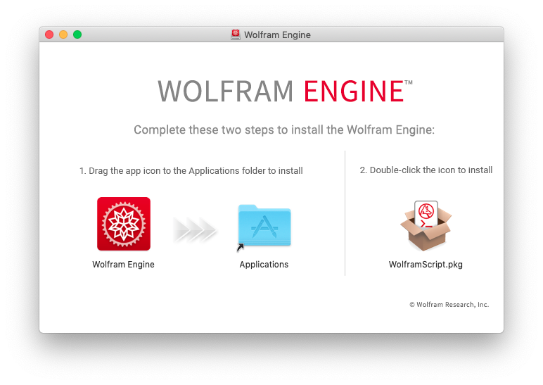

# Wolfram Engine
{: .no_toc }

## Table of contents
{: .no_toc .text-delta }

1. TOC
{:toc}

---

## Free Wolfram Engine for Developers

Here is what the [official website](https://www.wolfram.com/engine/) says:

> A locally downloadable Wolfram Engine to put computational intelligence into your applications
> 
> The Free Wolfram Engine for Developers is available for pre-production software development.
> 
> You can use this product to:
> 
> - Develop a product for yourself or your company
> - Conduct personal projects at home, at school, at work
> - Explore the Wolfram Language for future production projects

The process is straightforward:

1. Download [the installer for the macOS](https://www.wolfram.com/engine/).
2. Launch `WolframEngine_12.1.1_MAC_DLM.dmg` and wait for the real download, whose size is `1.1 GB`
3. Create a Wolfram ID
4. Install Wolfram Engine
5. Install WolframScript

Here is the [official step-by-step guide (with screenshots!)](https://support.wolfram.com/46070).

## WolframScript

The last step, installing WolframScript, has some nuance to it, so let me share the details.

WolframScript is a command-line tool (CLI) for using the Wolfram Language:

> WolframScript enables Wolfram Language code to be run from any terminal, whether or not a Wolfram kernel is available on the system.

Install it by double clicking on the `.pkg` icon that you will while installing the Engine:



In case you missed the `.pkg`, you can also download it from [this page](https://account.wolfram.com/products/downloads/wolframscript).

After installing it, you should be able to run:

```sh
which wolframscript
  /usr/local/bin/wolframscript

ls -lah /usr/local/bin/wolframscript
  lrwxr-xr-x  1 root  admin    60B Oct 11 18:41 /usr/local/bin/wolframscript -> /Applications/WolframScript.app/Contents/MacOS/wolframscript
```

Next, you will need to add your Wolfram ID credentials to activate your installation. 

There is a little trick to make `wolframscript` find the Wolfram Engine. If you simply run the vanilla command and enter your credentials:

```sh
wolframscript
```

It will fail with the following error message `The product exited during an activation attempt because an error occurred.`

D'oh!

Thanks to [this answer on Stack Exchange](https://mathematica.stackexchange.com/questions/228783/cant-install-wolframscript), here is what you need to do instead:

```sh
# teach wolframscript where your wolfram engine's kernel lives
# ref: How do I specify which kernel WolframScript should use? https://support.wolfram.com/47243
wolframscript -config WOLFRAMSCRIPT_KERNELPATH="/Applications/Wolfram Engine.app/Contents/MacOS/WolframKernel"
  Configured:WOLFRAMSCRIPT_KERNELPATH=/Applications/Wolfram Engine.app/Contents/MacOS/WolframKernel

# proceed with the activation, the engine will then start automatically
wolframscript
  The Wolfram Engine requires one-time activation on this computer.

  Visit https://wolfram.com/engine/free-license to get your free license.

  Wolfram ID: YOUR_ID
  Password: YOUR_PASSWORD

  Wolfram Engine activated. See https://www.wolfram.com/wolframscript/ for more information.
  Wolfram Language 12.1.1 Engine for Mac OS X x86 (64-bit)
  Copyright 1988-2020 Wolfram Research, Inc.

  In[1]:= 1 + 1

  Out[1]= 2

  In[2]:= Quit
```

Next: install the [Wolfram Language kernel for Jupyter](wolfram-language-for-jupyter.html).